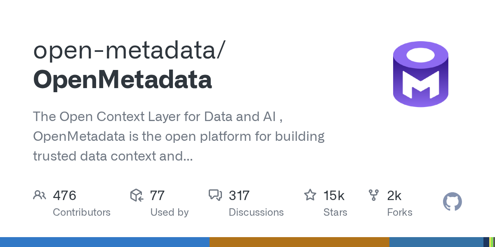

# open-metadata/OpenMetadata

**⭐ 14 915** · **язык: TypeScript** · **forks: 2 320** · **license: Apache-2.0**

> AI · известность · активный push

## Суть

The Open Context Layer for Data and AI ,  OpenMetadata is the open platform for building trusted data context and business semantics for humans, AI assistants, and agents.

## Почему в ленте

- ветка: `imba/ai` (AI)
- score: `144.6`
- источник: `search:ai`
- топики: `context`, `context-layer`, `data-catalog`, `data-collaboration`, `data-contracts`, `data-discovery`, `data-governance`, `data-lineage`

## Из README

**The largest and fastest-growing open-source project for AI context, data cataloging, and metadata management.** OpenMetadata is the open platform for trusted data context, organizational memory, and business semantics for every data user, AI assistant, and agent. OpenMetadata connects technical metadata, data quality…

## Ссылки

[Репозиторий](https://github.com/open-metadata/OpenMetadata) · [сайт](https://open-metadata.org)

---
2026-08-20 · imba-radar
