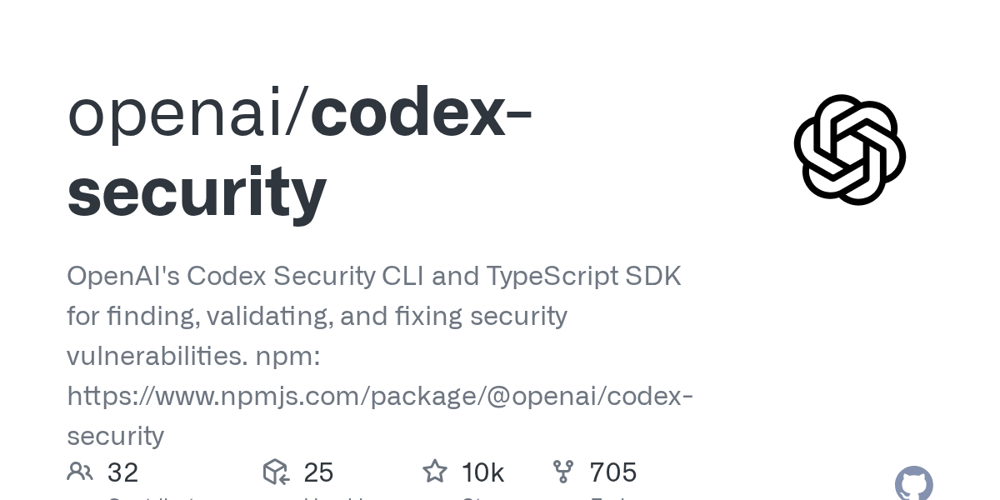

# openai/codex-security

**⭐ 9 980** · **язык: TypeScript** · **forks: 705** · **license: Apache-2.0**

> Tools · известность · активный push

## Суть

OpenAI's Codex Security CLI and TypeScript SDK for finding, validating, and fixing security vulnerabilities. npm: https://www.npmjs.com/package/@openai/codex-security

## Почему в ленте

- ветка: `imba/tools` (Tools)
- score: `144.6`
- источник: `search:tools`
- топики: `ai-security`, `application-security`, `cli`, `code-scanning`, `codex`, `codex-security`, `cybersecurity`, `devsecops`

## Из README

`@openai/codex-security` is a CLI and TypeScript SDK for finding, validating, and fixing security vulnerabilities in your code. **See the [Codex Security documentation](https://learn.chatgpt.com/docs/security/cli)** for more details. Some cybersecurity requests and protected findings require approval through

## Ссылки

[Репозиторий](https://github.com/openai/codex-security) · [сайт](https://developers.openai.com/codex/security)

---
2026-08-20 · imba-radar
