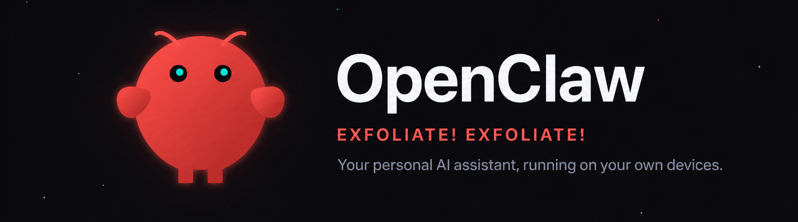

# openclaw/openclaw

**⭐ 386 804** · **язык: TypeScript** · **forks: 81 264** · **license: NOASSERTION**

> AI · известность · активный push

## Суть

Your own personal AI assistant. Any OS. Any Platform. The lobster way. 🦞

## Почему в ленте

- ветка: `imba/ai` (AI)
- score: `140.6`
- источник: `search:ai`
- топики: `ai`, `assistant`, `crustacean`, `molty`, `openclaw`, `own-your-data`, `personal`

## Из README

 <picture> <source media="(prefers-color-scheme: light)" srcset="https://raw.githubusercontent.com/openclaw/openclaw/main/docs/assets/openclaw-banner-light.png"> 2026-08-20 · imba-radar
