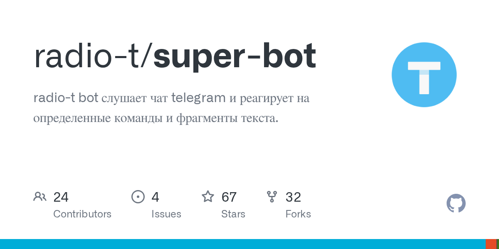

# radio-t/super-bot

**⭐ 67** · **язык: Go** · **forks: 32** · **license: MIT**

> Bots · активный push

## Суть

radio-t bot слушает чат telegram и реагирует на определенные команды и фрагменты текста.

## Почему в ленте

- ветка: `imba/bots` (Bots)
- score: `52.2`
- источник: `search:bots`
- топики: `bot`, `telegram`, `telegram-bot`

## Из README

Бот слушает [чат Telegram](https://t.me/radio_t_chat) и реагирует на определенные команды и фрагменты текста. Кроме этого, он слушает API новостей и публикует в Telegram сообщения о начале выпуска и смене тем. С ботом можно [общаться тет-а-тет](https://t.me/radiot_superbot), не засорая общий чат.

## Ссылки

[Репозиторий](https://github.com/radio-t/super-bot)

---
2026-08-20 · imba-radar
