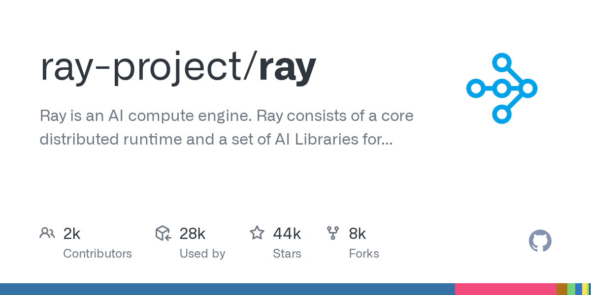

# ray-project/ray

**⭐ 43 561** · **язык: Python** · **forks: 7 940** · **license: Apache-2.0**

> AI · известность · активный push

## Суть

Ray is an AI compute engine. Ray consists of a core distributed runtime and a set of AI Libraries for accelerating ML workloads.

## Почему в ленте

- ветка: `imba/ai` (AI)
- score: `144.6`
- источник: `search:ai`
- топики: `data-science`, `deep-learning`, `deployment`, `distributed`, `hyperparameter-optimization`, `hyperparameter-search`, `large-language-models`, `llm`

## Из README

.. image:: https://github.com/ray-project/ray/raw/master/doc/source/images/ray_header_logo.png .. image:: https://readthedocs.org/projects/ray/badge/?version=master :target: http://docs.ray.io/en/master/?badge=master .. image:: https://img.shields.io/badge/Ray-Join%20Slack-blue :target: https://www.ray.io/join-slack

## Ссылки

[Репозиторий](https://github.com/ray-project/ray) · [сайт](https://ray.io)

---
2026-08-20 · imba-radar
