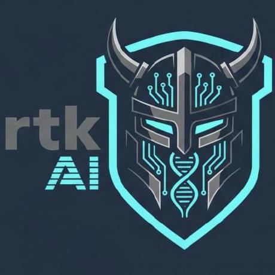

# rtk-ai/rtk

**⭐ 76 698** · **язык: Rust** · **forks: 4 827** · **license: Apache-2.0**

> AI · известность · активный push

## Суть

CLI proxy that reduces LLM token consumption by 60-90% on common dev commands. Single Rust binary, zero dependencies

## Почему в ленте

- ветка: `imba/ai` (AI)
- score: `144.6`
- источник: `search:tools`
- топики: `agentic-coding`, `ai-coding`, `anthropic`, `claude-code`, `cli`, `command-line-tool`, `cost-reduction`, `developer-tools`

## Из README

  
 
 <strong>High-performance CLI proxy that cuts up to 90% of the bash output your agent reads</strong> 
 
 <a href="https://github.com/rtk-ai/rtk/action…

## Ссылки

[Репозиторий](https://github.com/rtk-ai/rtk) · [сайт](https://www.rtk-ai.app)

---
2026-08-20 · imba-radar
