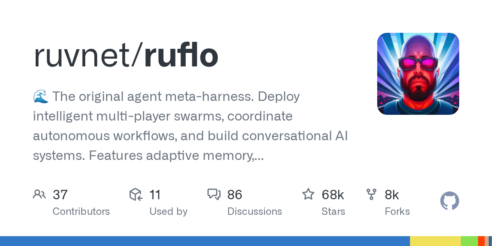

# ruvnet/ruflo

**⭐ 68 365** · **язык: TypeScript** · **forks: 8 207** · **license: MIT**

> AI · известность · активный push

## Суть

🌊 The original agent meta-harness. Deploy intelligent multi-player swarms, coordinate autonomous workflows, and build conversational AI systems. Features adaptive memory, self-learning intelligence, RAG integration, and native Claude Code / Codex / Hermes and many more Integrated

## Почему в ленте

- ветка: `imba/ai` (AI)
- score: `144.6`
- источник: `trending:typescript`
- топики: `agentic-ai`, `agentic-framework`, `agentic-workflow`, `agents`, `ai-agents`, `ai-assistant`, `ai-coding`, `ai-skills`

## Из README

 <!-- Try Ruflo — the 4 badges first-time visitors actually act on --> <!-- Ecosystem strip (collapsed visually with flat-square) --> **An agent meta-harness for Claude Code and Codex.** 
 > **Agent = Model + Harness.** The model writes; the harness gives it tools, memory, loops, sandboxes, and…

## Ссылки

[Репозиторий](https://github.com/ruvnet/ruflo) · [сайт](https://Cognitum.One)

---
2026-08-20 · imba-radar
