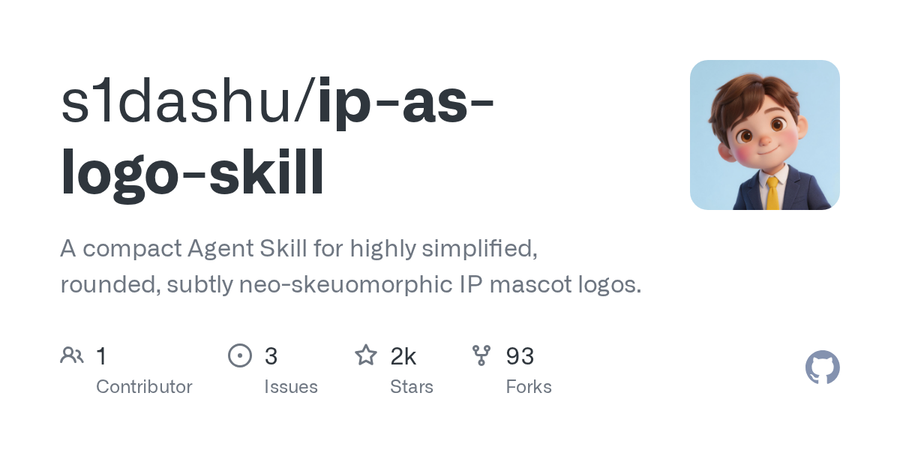

# s1dashu/ip-as-logo-skill

**⭐ 2 078** · **язык: n/a** · **forks: 93** · **license: MIT**

> AI · известность · свежий репо · активный push

## Суть

A compact Agent Skill for highly simplified, rounded, subtly neo-skeuomorphic IP mascot logos.

## Почему в ленте

- ветка: `imba/ai` (AI)
- score: `139.4`
- источник: `search:hot`
- топики: `codex`, `codex-skill`, `image-generation`, `logo-design`, `mascot-design`

## Из README

`ip-as-logo` is a compact Agent Skill for generating highly simplified company-ready mascot logos. It treats the result as a logo first and a character second: familiar cute animals by default, bold rounded silhouettes, strict complexity limits, oversized corner composition, and extremely subtle neo-skeuomorphic shadin…

## Ссылки

[Репозиторий](https://github.com/s1dashu/ip-as-logo-skill) · [сайт](https://ip-as-logo-skill.vercel.app)

---
2026-08-20 · imba-radar
