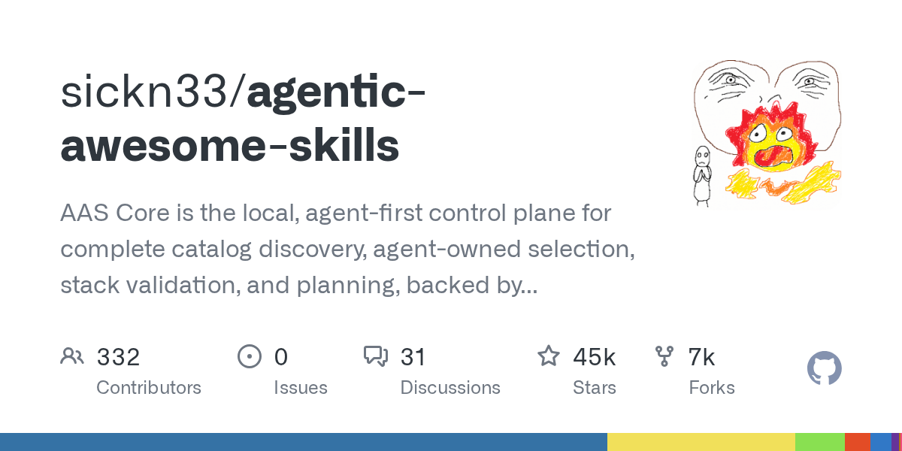

# sickn33/agentic-awesome-skills

**⭐ 45 152** · **язык: Python** · **forks: 6 610** · **license: MIT**

> AI · известность · активный push

## Суть

AAS Core is the local, agent-first control plane for complete catalog discovery, agent-owned selection, stack validation, and planning, backed by 2,005+ agentic skills. Includes CLI, local MCP, catalog, plugins, and Workbench.

## Почему в ленте

- ветка: `imba/ai` (AI)
- score: `144.6`
- источник: `search:ai`
- топики: `agent-skills`, `agentic-skills`, `ai-agent-skills`, `ai-agents`, `ai-coding`, `ai-workflows`, `antigravity`, `antigravity-skills`

## Из README

<!-- registry-sync: version=15.15.0; skills=2025; stars=45082; updated_at=2026-08-18T07:23:09+00:00 --> > **Local, agent-owned skill stacks for coding agents—from complete catalog access to a reproducible, reviewable plan.** **Current release: V15.15.0.** This release includes AAS Core for complete local catalog search…

## Ссылки

[Репозиторий](https://github.com/sickn33/agentic-awesome-skills) · [сайт](https://sickn33.github.io/agentic-awesome-skills/)

---
2026-08-20 · imba-radar
