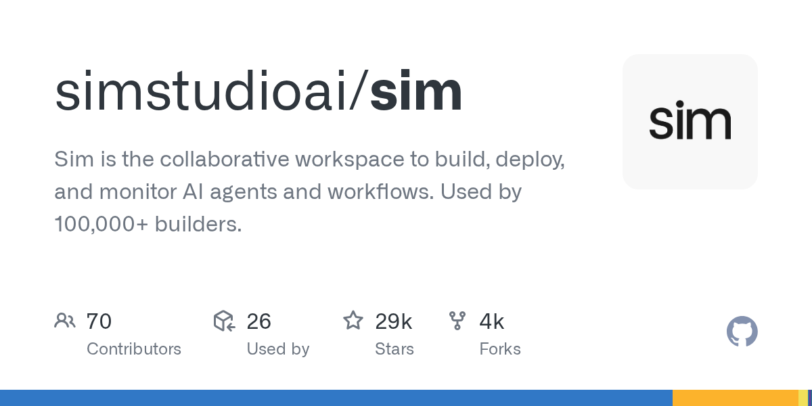

# simstudioai/sim

**⭐ 29 437** · **язык: TypeScript** · **forks: 3 779** · **license: Apache-2.0**

> AI · известность · активный push

## Суть

Sim is the collaborative workspace to build, deploy, and monitor AI agents and workflows. Used by 100,000+ builders.

## Почему в ленте

- ветка: `imba/ai` (AI)
- score: `144.6`
- источник: `trending:typescript`
- топики: `agent-workflow`, `agentic-workflow`, `agents`, `ai`, `aiagents`, `anthropic`, `artificial-intelligence`, `automation`

## Из README

  <a href="https://docs.sim.ai" target="_blank" rel="noopener noreferrer">2026-08-20 · imba-radar
