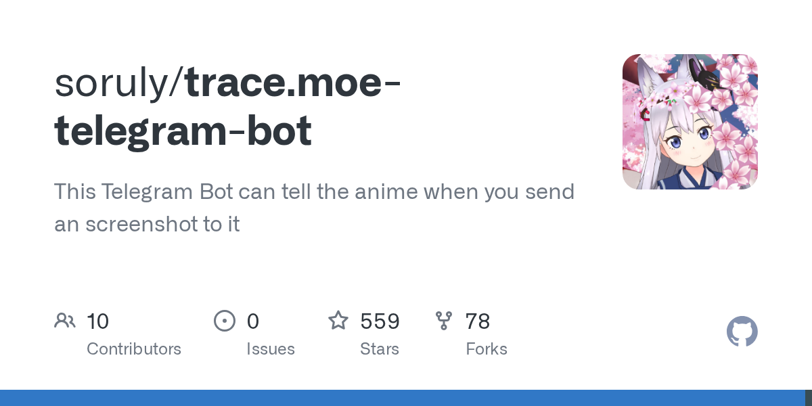

# soruly/trace.moe-telegram-bot

**⭐ 559** · **язык: TypeScript** · **forks: 78** · **license: MIT**

> Bots · известность · активный push

## Суть

This Telegram Bot can tell the anime when you send an screenshot to it

## Почему в ленте

- ветка: `imba/bots` (Bots)
- score: `80.9`
- источник: `search:bots`
- топики: `anime`, `cbir`, `heroku`, `image-retrieval`, `image-search`, `telegram-bot`, `visual-search`

## Из README

This Telegram Bot can tell the anime when you send an screenshot to it https://telegram.me/WhatAnimeBot https://user-images.githubusercontent.com/1979746/126060529-8a33523a-967b-48de-9f67-bd0273076e7b.mp4 - Show anime titles, episode, and timestamp from trace.moe - Image, GIF, Video, Stickers, URL support

## Ссылки

[Репозиторий](https://github.com/soruly/trace.moe-telegram-bot) · [сайт](https://t.me/WhatAnimeBot)

---
2026-08-20 · imba-radar
