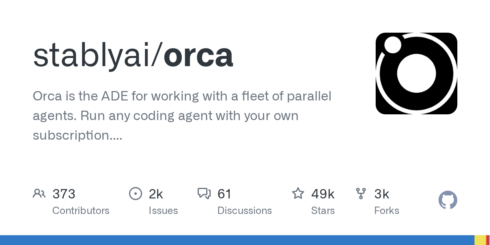

# stablyai/orca

**⭐ 49 111** · **язык: TypeScript** · **forks: 3 389** · **license: MIT**

> Tools · известность · активный push

## Суть

Orca is the ADE for working with a fleet of parallel agents. Run any coding agent with your own subscription. Available on desktop, mobile and VPS.

## Почему в ленте

- ветка: `imba/tools` (Tools)
- score: `144.6`
- источник: `search:tools`
- топики: `ade`, `agent-ide`, `ai-agents`, `claude-code`, `cli`, `codex`, `cursor-agent`, `devtools`

## Из README

<h1 align="center">  Orca </h1> 
 <a href="https://github.com/stablyai/orca">2026-08-20 · imba-radar
