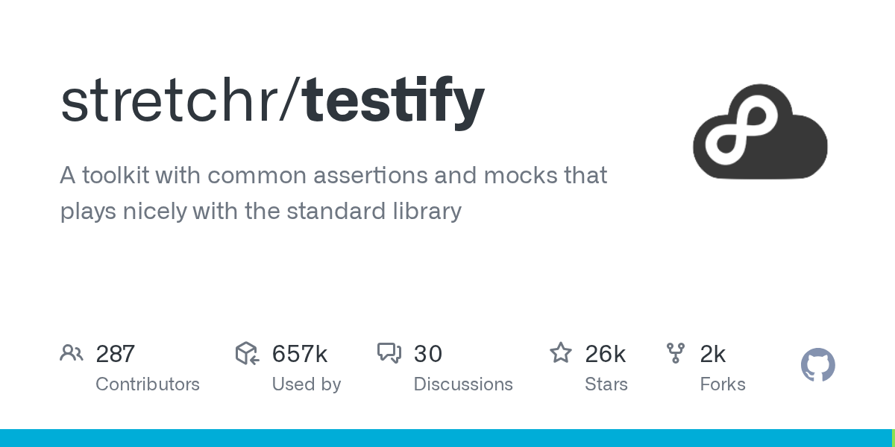

# stretchr/testify

**⭐ 26 167** · **язык: Go** · **forks: 1 913** · **license: MIT**

> Tools · известность · активный push

## Суть

A toolkit with common assertions and mocks that plays nicely with the standard library

## Почему в ленте

- ветка: `imba/tools` (Tools)
- score: `144.6`
- источник: `trending:go`
- топики: `assertions`, `go`, `golang`, `mocking`, `testify`, `testing`, `toolkit`

## Из README

Testify - Thou Shalt Write Tests ================================ > [!NOTE] > Testify is being maintained at v1, no breaking changes will be accepted in this repo. > [See discussion about v2](https://github.com/stretchr/testify/discussions/1560). Go code (golang) set of packages that provide many tools for testifying t…

## Ссылки

[Репозиторий](https://github.com/stretchr/testify) · [сайт](https://pkg.go.dev/github.com/stretchr/testify)

---
2026-08-20 · imba-radar
