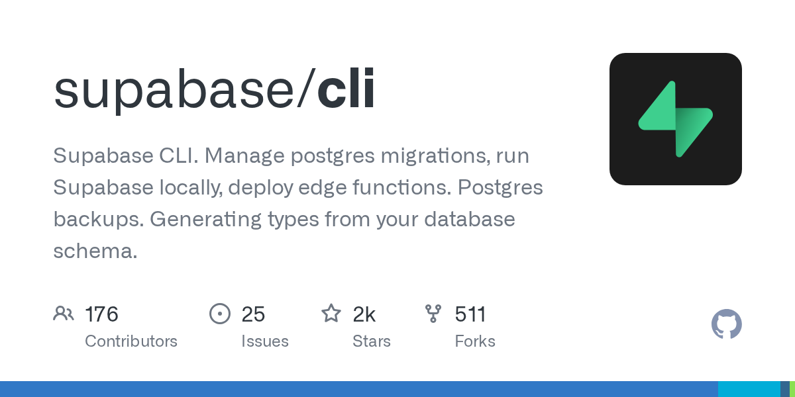

# supabase/cli

**⭐ 2 390** · **язык: TypeScript** · **forks: 511** · **license: n/a**

> Tools · известность · активный push

## Суть

Supabase CLI. Manage postgres migrations, run Supabase locally, deploy edge functions. Postgres backups. Generating types from your database schema.

## Почему в ленте

- ветка: `imba/tools` (Tools)
- score: `111.9`
- источник: `search:tools`
- топики: `cli`, `database`, `database-management`, `dbms`, `environment`, `local`, `postgres`, `postgresql`

## Из README

 <a href="https://supabase.com"> <picture> <source media="(prefers-color-scheme: dark)" srcset="./docs/assets/supabase-cli-wordmark-dark.svg">  </picture> </a> 
 

## Ссылки

[Репозиторий](https://github.com/supabase/cli) · [сайт](https://supabase.com/docs/reference/cli/about)

---
2026-08-20 · imba-radar
