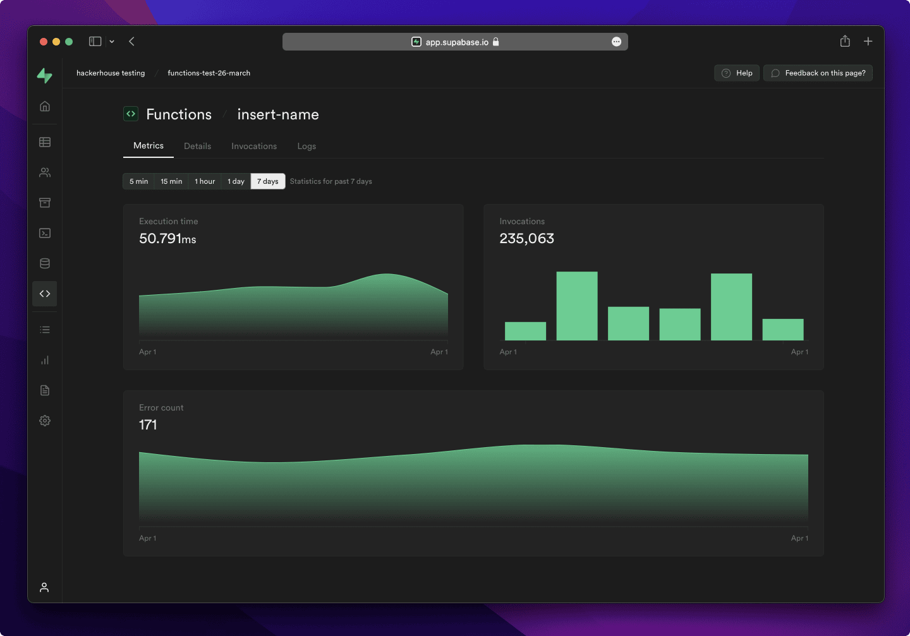

# supabase/supabase

**⭐ 108 174** · **язык: TypeScript** · **forks: 13 591** · **license: Apache-2.0**

> AI · известность · активный push

## Суть

The Postgres development platform. Supabase gives you a dedicated Postgres database to build your web, mobile, and AI applications.

## Почему в ленте

- ветка: `imba/ai` (AI)
- score: `144.6`
- источник: `search:ai`
- топики: `ai`, `alternative`, `auth`, `database`, `deno`, `embeddings`, `example`, `firebase`

## Из README

  

## Ссылки

[Репозиторий](https://github.com/supabase/supabase) · [сайт](https://supabase.com)

---
2026-08-20 · imba-radar
