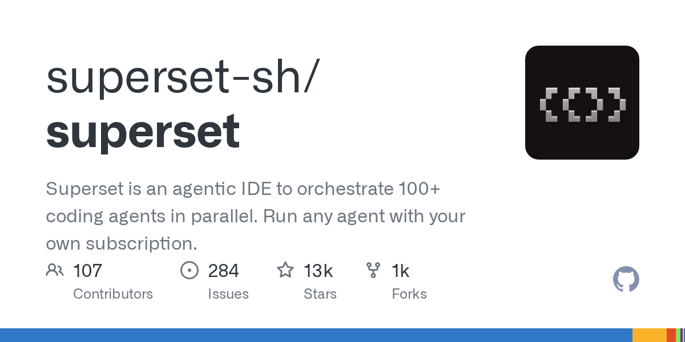

# superset-sh/superset

**⭐ 13 104** · **язык: TypeScript** · **forks: 1 201** · **license: NOASSERTION**

> Tools · известность · активный push

## Суть

Superset is an agentic IDE to orchestrate 100+ coding agents in parallel. Run any agent with your own subscription.

## Почему в ленте

- ветка: `imba/tools` (Tools)
- score: `140.6`
- источник: `search:tools`
- топики: `ade`, `agent`, `agent-orchestration`, `ai-agents`, `ai-coding`, `claude-code`, `cli`, `codex`

## Из README

    Claude Code, Codex, or any CLI agent, each in its own isolated worktree.  Spend your time shipping, not waiting.

## Ссылки

[Репозиторий](https://github.com/superset-sh/superset) · [сайт](https://superset.sh)

---
2026-08-20 · imba-radar
