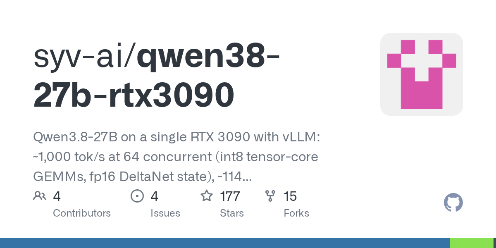

# syv-ai/qwen38-27b-rtx3090

**⭐ 177** · **язык: Python** · **forks: 15** · **license: Apache-2.0**

> AI · известность · активный push

## Суть

Qwen3.8-27B on a single RTX 3090 with vLLM: ~1,000 tok/s at 64 concurrent (int8 tensor-core GEMMs, fp16 DeltaNet state), ~114 tok/s single-user at default sampling / ~124 greedy (MTP drafts, own-output draft vocab, calibrated int4 lm_head, split-KV verify attention), 150k-262k context; patches, requant scripts, benchmarks

## Почему в ленте

- ветка: `imba/ai` (AI)
- score: `76.6`
- источник: `search:hot`
- топики: `kv-cache`, `llm-inference`, `local-llm`, `quantization`, `qwen`, `qwen3`, `rtx-3090`, `speculative-decoding`

## Из README

Serving setup for [Qwen3.8-27B](https://huggingface.co/Qwen/Qwen3.8-27B) on a single 24 GB consumer GPU with vLLM. 150k token context, OpenAI-compatible API with key auth, and two ready-made configs depending on what you're doing: | | [batch/](batch/) | [single-user/](single-user/) |

## Ссылки

[Репозиторий](https://github.com/syv-ai/qwen38-27b-rtx3090)

---
2026-08-20 · imba-radar
