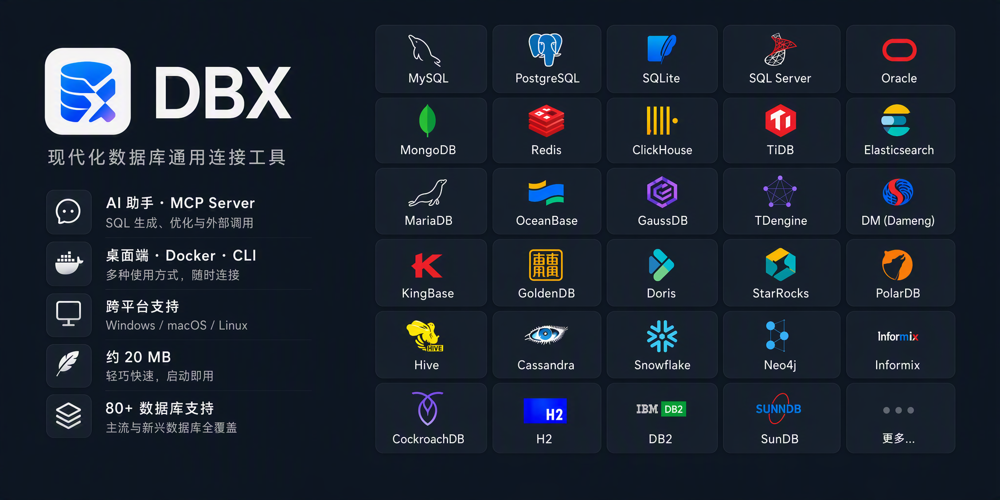

# t8y2/dbx

**⭐ 15 911** · **язык: Rust** · **forks: 1 567** · **license: Apache-2.0**

> AI · известность · активный push

## Суть

20 MB lightweight cross-platform database client for 80+ databases, including MySQL, PostgreSQL, SQLite, Redis, MongoDB, DuckDB, SQL Server, and Dameng. Built-in AI, MCP Server, CLI, desktop and Docker. | 轻量级跨平台数据库管理工具，支持 MySQL、PostgreSQL、SQLite、Redis、MongoDB、达梦等 80+ 数据库，提供桌面端、Docker、CLI、内置 AI 助手和 MCP Server。

## Почему в ленте

- ветка: `imba/ai` (AI)
- score: `144.6`
- источник: `search:tools`
- топики: `ai`, `cli`, `clickhouse`, `database`, `database-client`, `database-management`, `docker`, `gui`

## Из README

 
<strong>80+ databases in 20 MB. Desktop, Docker, CLI, built-in AI assistant, and MCP Server.</strong>
 
  

## Ссылки

[Репозиторий](https://github.com/t8y2/dbx) · [сайт](https://dbxio.com)

---
2026-08-20 · imba-radar
