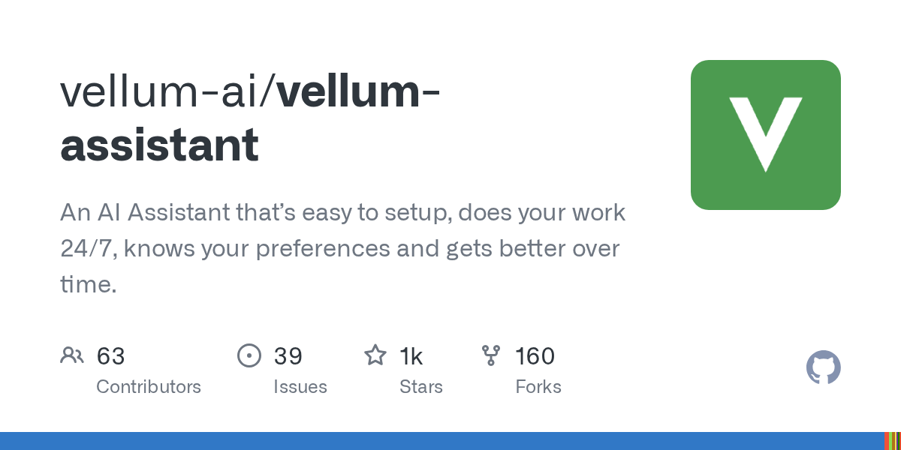

# vellum-ai/vellum-assistant

**⭐ 1 093** · **язык: TypeScript** · **forks: 160** · **license: MIT**

> AI · известность · активный push

## Суть

An AI Assistant that’s easy to setup, does your work 24/7, knows your preferences and gets better over time.

## Почему в ленте

- ветка: `imba/ai` (AI)
- score: `94.3`
- источник: `search:bots`
- топики: `agent`, `agentic-ai`, `ai-assistant`, `anthropic`, `autonomous-agents`, `claude`, `claude-code`, `ios`

## Из README

  
 
  <a href="https://vellum.ai/community">2026-08-20 · imba-radar
