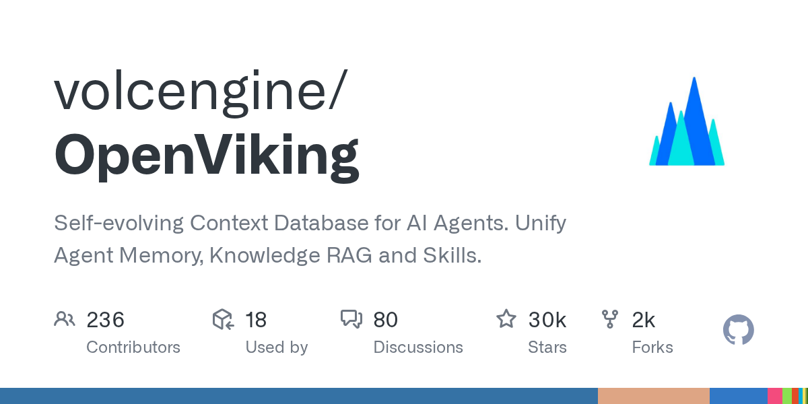

# volcengine/OpenViking

**⭐ 30 177** · **язык: Python** · **forks: 2 335** · **license: AGPL-3.0**

> AI · известность · активный push

## Суть

Self-evolving Context Database for AI Agents. Unify Agent Memory, Knowledge RAG and Skills.

## Почему в ленте

- ветка: `imba/ai` (AI)
- score: `144.6`
- источник: `trending:all`
- топики: `agent-memory`, `agent-plugins`, `agentic-rag`, `context-database`, `dsh-plugin`, `self-evolving`

## Из README

 <a href="https://openviking.ai/" target="_blank"> <picture>  </picture> </a> English / [中文](README_CN.md) / [日本語](README_JA.md) <a href="https://www.openviking.ai">Website</a> · <a href="https://openviking.ai/studio">Li…

## Ссылки

[Репозиторий](https://github.com/volcengine/OpenViking) · [сайт](https://openviking.ai/)

---
2026-08-20 · imba-radar
