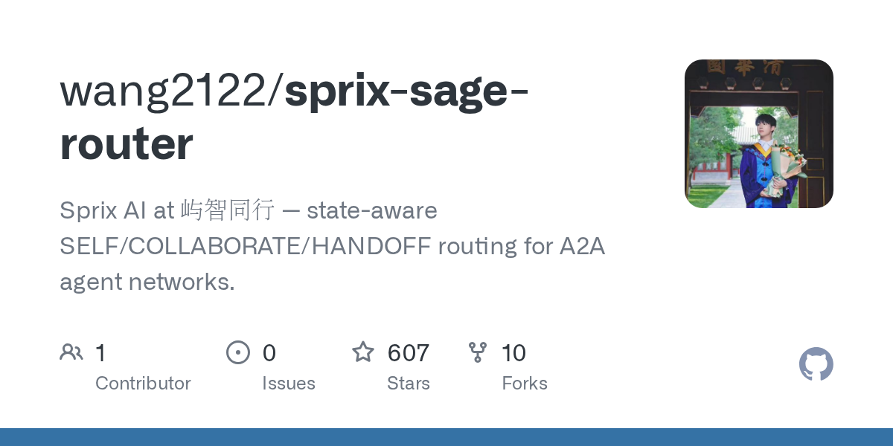

# wang2122/sprix-sage-router

**⭐ 607** · **язык: Python** · **forks: 10** · **license: MIT**

> AI · известность · свежий репо

## Суть

Sprix AI at 屿智同行 — state-aware SELF/COLLABORATE/HANDOFF routing for A2A agent networks.

## Почему в ленте

- ветка: `imba/ai` (AI)
- score: `97.3`
- источник: `search:hot`
- топики: `a2a`, `agent-orchestration`, `agent-routing`, `ai-agents`, `multi-agent-systems`, `python`, `sprix-ai`, `task-scheduling`

## Из README

 **An open-source research output of [Sprix AI](#about-sprix-ai) at 屿智同行.** Choose whether an agent should **continue alone**, **recruit complementary collaborators**, or **hand off the task**—then assign task-DAG roles, schedule dependencies, and learn from execution evidence under permission, budg…

## Ссылки

[Репозиторий](https://github.com/wang2122/sprix-sage-router)

---
2026-08-20 · imba-radar
