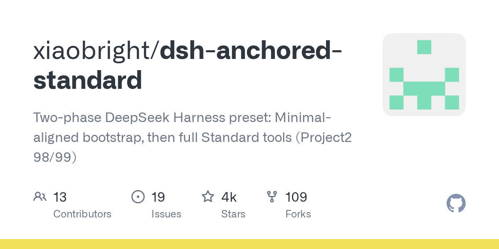

# xiaobright/dsh-anchored-standard

**⭐ 3 638** · **язык: JavaScript** · **forks: 109** · **license: NOASSERTION**

> AI · известность

## Суть

Two-phase DeepSeek Harness preset: Minimal-aligned bootstrap, then full Standard tools (Project2 98/99)

## Почему в ленте

- ветка: `imba/ai` (AI)
- score: `129.9`
- источник: `search:hot`
- топики: `deepseek`, `deepseek-harness`, `dsh-plugin`, `llm-agent`

## Из README

[中文说明](./README.zh-CN.md) Experimental DeepSeek Harness agent presets — a base mode, two live-anchor variants, and one seeded prefab mode — that anchor a session's model trajectory on the Minimal condition (real Minimal tool schema, no auto-injected context), then promote to a small

## Ссылки

[Репозиторий](https://github.com/xiaobright/dsh-anchored-standard) · [сайт](https://github.com/xiaobright/modeltest)

---
2026-08-20 · imba-radar
