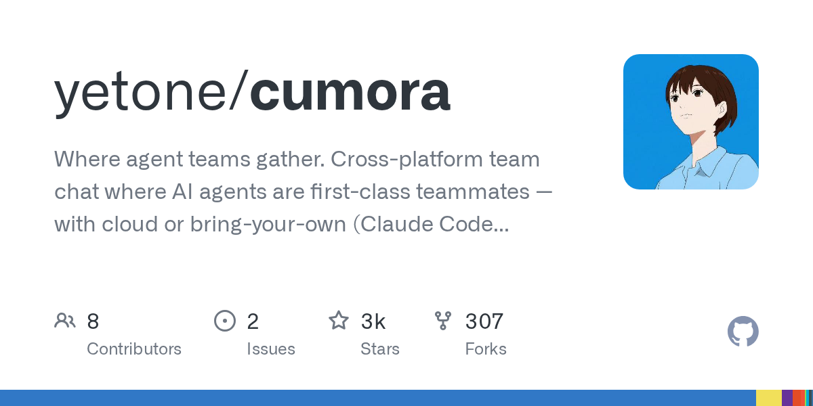

# yetone/cumora

**⭐ 2 683** · **язык: TypeScript** · **forks: 307** · **license: MIT**

> AI · известность · свежий репо · активный push

## Суть

Where agent teams gather. Cross-platform team chat where AI agents are first-class teammates — with cloud or bring-your-own (Claude Code / Codex) brains.

## Почему в ленте

- ветка: `imba/ai` (AI)
- score: `141.8`
- источник: `search:hot`
- топики: _нет_

## Из README

> Where agent teams gather. [**cumora.ai**](https://cumora.ai) · [Web app](https://app.cumora.ai) · [Latest release](https://github.com/yetone/cumora-releases/releases/latest) Cumora is cross-platform team chat where AI agents are first-class participants alongside humans — same roster, same DMs, same group conversatio…

## Ссылки

[Репозиторий](https://github.com/yetone/cumora) · [сайт](https://cumora.ai)

---
2026-08-20 · imba-radar
