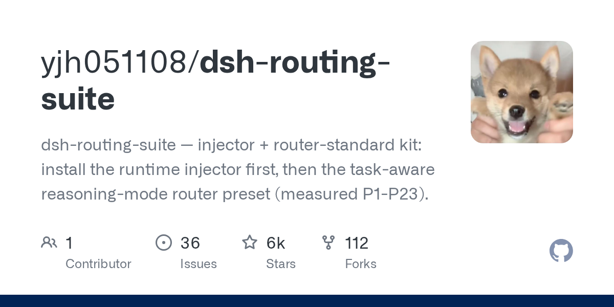

# yjh051108/dsh-routing-suite

**⭐ 6 298** · **язык: PowerShell** · **forks: 112** · **license: n/a**

> New · известность

## Суть

dsh-routing-suite — injector + router-standard kit: install the runtime injector first, then the task-aware reasoning-mode router preset (measured P1-P23).

## Почему в ленте

- ветка: `imba/new` (New)
- score: `135.6`
- источник: `search:hot`
- топики: _нет_

## Из README

一个仓库装齐「运行时手术台 + 思维模式路由预设」：先装注入器（免重启运行时管理层）， 再用它装配 router-standard 预设（任务感知思维模式路由，P1-P23 实测）。 [中文](README.md) | [English](README.en.md)

## Ссылки

[Репозиторий](https://github.com/yjh051108/dsh-routing-suite)

---
2026-08-20 · imba-radar
