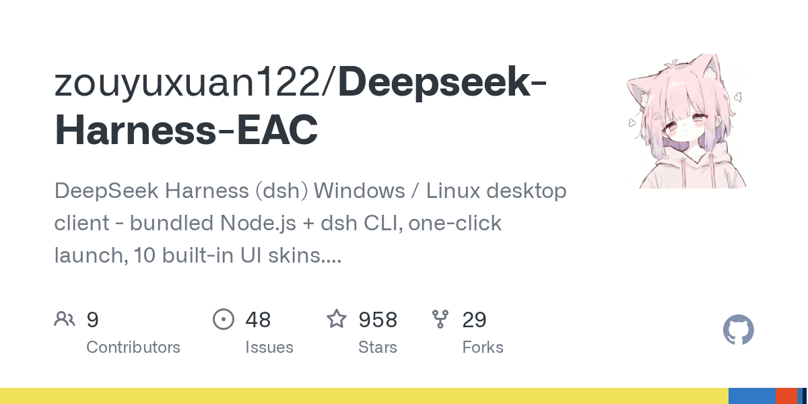

# zouyuxuan122/Deepseek-Harness-EAC

**⭐ 958** · **язык: JavaScript** · **forks: 29** · **license: n/a**

> AI · известность · активный push

## Суть

DeepSeek Harness (dsh) Windows / Linux desktop client - bundled Node.js + dsh CLI, one-click launch, 10 built-in UI skins. EAC: Embracing All Creation 揽尽万象

## Почему в ленте

- ветка: `imba/ai` (AI)
- score: `101.3`
- источник: `search:hot`
- топики: `ai-agent`, `deepseek`, `desktop-app`, `dsh`, `electron`, `windows`

## Из README

 
<a href="README.md">中文</a> | <a href="README.en.md">English</a>
 <h1>Deepseek Harness EAC — 揽尽万象</h1> 
<strong>EAC = Embracing All Creation（揽尽万象）</strong>
 
 <a href="https://github.com/zouyuxuan122/Deepseek-Harness-EAC">2026-08-20 · imba-radar
